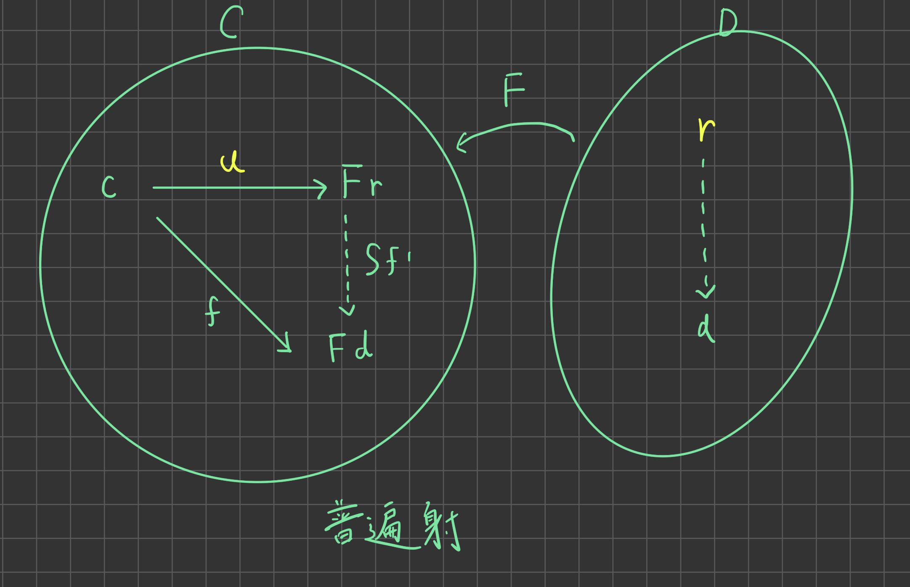

# 圏論

圏論を書きます。

## 圏

### 定義:圏 (Category)

圏(Category)とは以下で定義される$(Ob,Mor,Id,Dom,Cod,Com)$の６つ組である。

- $Ob$ は対象(Objec)の集まり（集合とは限らない）
- $Mor$ は射(Morphism)の集まり（集合とは限らない）
- $Dom$は$Dom:Mor \rightarrow Ob$の射
- $Cod$は$Cod:Mor \rightarrow Ob$をの射
- $Id$ は$Id:Ob \rightarrow Mor$の射
- $Com$ は$Com:(Mor,Mor) \rightarrow Mor$の射
  
これら６つ組は以下の公理を満たす

1. $f,g,h \in Mor Cod(f) = Dom(g) \land Cod(g) = Dom(h)\\ \implies Com(Com(f,g),h) = Com(f,Com(g,h))$

2. $\forall f \in Mor ,Com(Mor(Id(Cod(f))),f) = Com(f,Mor(Id(Dom(f))))$

記法として、圏$C$の対象の集まりを$Ob(C)$,射の集まりを$Mor(C)$と書く。

### 定義:関手

$C$,$D$を圏とする。$C$から$D$への関手とは$a \in Ob(C) に F(a) \in Ob(D)$を $f \in Mor(c)$に$F(f) \in Mor(D)$を対応させる関数であり、以下を満たす。

 1. $d:a \rightarrow b \implies F(a) \rightarrow F(b)$
 2. $Cod(f) = Dom(g) \implies F(g\circ f) = F(g) \circ F(f)$
 3. $a \in C$について$F(id_a) = id_{F(a)}$ 

### 定義:自然変換

$C$,$D$を圏とする。
$F,G:C\rightarrow D$ を関手とする。FからGへの自然変換とはDの射のあつまり（族）$\theta = \{\theta_a : Fa \rightarrow Ga \}$ $a \in C$ であって$C$の射$f$について$Gf \circ \theta_a = \theta_b \circ Ff$を満たすものである。

### 定義：普遍射

$C$,$D$を圏とする。
$F:D\rightarrow C$ を関手とする。 $c \in C$について$c$から$F$への普遍射(universal arrow)とは$D$の対象$r$と$C$の射$f:c \rightarrow Fd$からなる全ての対$<d,f>$について$Sf' \circ u = f$となる$D$の一意な射$f':r \rightarrow d$が存在するものである。

 <figure>  <figcaption>図：普遍射</figcaption></figure>

