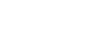

# 圏

## 圏 - 定義

これから書く

# 随伴関手

##  随伴関手 - 定義

$C$,$D$を圏、$F:C \rightarrow D$,$G:D \rightarrow C$を関手とする。 $c \in C$, $d \in D$について自然な同型射$\phi_{cd}:Hom_D(Fc,d) \rightarrow Hom_C(c,Gd)$が素材するとき3つ組$<F,G,\phi>$を随伴という。このとき記号では$F\dashv G: C \rightarrow D$もしくは単に$F\dashv G$と書く。また$F$を$G$の左随伴関手、Gを(Fの)右随伴関手と言う。

$F\dashv G: C \rightarrow D$とすると、自然同型$\phi$により次のような2つの射が一対一対応する。

$$ f:Fc \rightarrow d \ \ \ \ g:c \rightarrow Gd $$

$\phi_{cd}(f) = g$のとき$g$を$f$の右随伴射(right adjunct),$f$を$g$の左随伴射(left adjunct)と呼ぶ。

$q:d \rightarrow d^\prime を$$D$の射とする。つまり$Hom_D(d,d^\prime) \ni q$である。$q$の右随伴射が$Gq$と$\phi$との間で以下の図式が可換になる。

<!-- 
 <figure> </figure>
 -->

